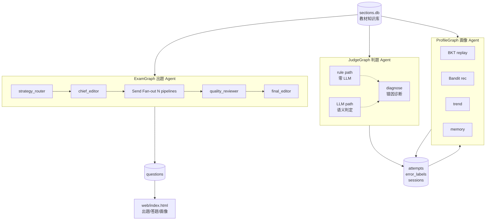
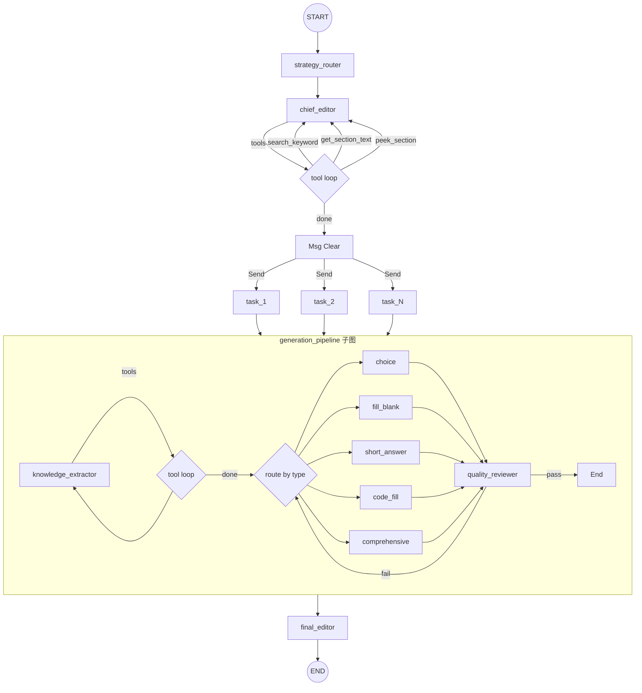
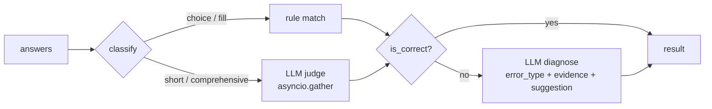
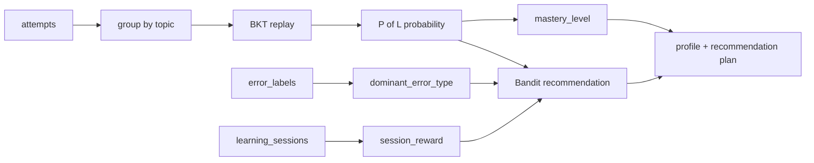
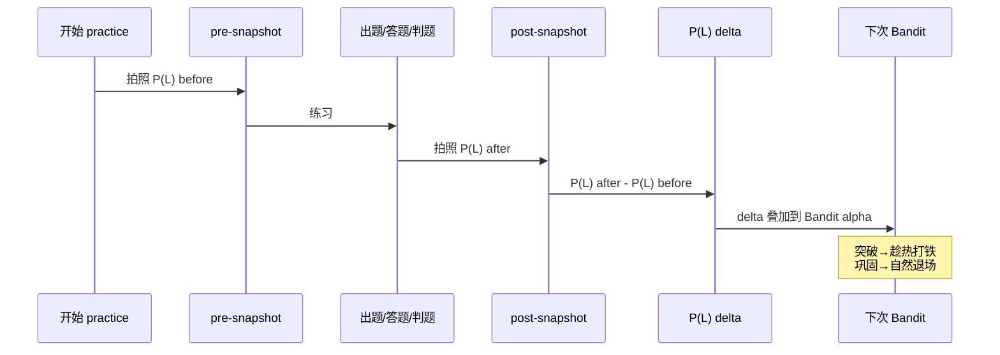

# 期末大学生速通系统

基于 **LangGraph** 构建的多 Agent 协作学习系统。三个独立 Agent 共享教材知识库与学生数据库，通过松耦合数据接力覆盖出题→答题→判题→画像→推荐的完整闭环。

---

## 架构



三个 Agent 不直接通信，通过 `attempts` / `error_labels` / `learning_sessions` 三张表完成数据接力。

---

## Agent 详解

### ExamGraph — 出题 Agent

LangGraph 深度编排的出题流水线，支持三种模式：

| 模式 | 策略 | 说明 |
|---|---|---|
| `exam` | 全书/按知识点覆盖 | 指定章节或全书覆盖，支持往年试卷分析参考 |
| `diagnostic` | 每章 2 道 easy 选择题 | 摸底检测，快速定位薄弱点 |
| `practice` | BKT + Bandit 弱点攻坚 | 基于画像薄弱点 + Thompson Sampling 推荐 |

**图结构**：



**核心 LangGraph 特性**：

- **Send API 动态 Fan-out**：chief_editor 生成的 exam_plan 通过 `langgraph.types.Send` 动态分发，每道题启动一条独立流水线，N 条并发
- **子图嵌套**：`generation_pipeline` 是独立编译的 `StateGraph`，包含知识提取→生成→质检的完整回路
- **三层条件路由**：工具循环（是否继续搜索）+ 题型路由（5 个生成器）+ 质检回路（通过/失败/重试）
- **Annotated Reducer**：`all_questions: Annotated[list, operator.add]` 并发写入自动合并

### JudgeGraph — 判题 Agent

双路径判题管道：



- 客观题零 LLM 消耗，双 Semaphore 隔离防止拥塞
- LLM 异常自动降级为本地精确匹配

### ProfileGraph — 画像 Agent

从作答历史实时聚合：



---

## 算法

### BKT（贝叶斯知识追踪）

对每个知识点独立建模，每一步有 3 个操作：

**Step 1 — 学习转移**

$$P(L) \leftarrow P(L) + (1 - P(L)) \times P(T)$$

> 还不会的部分里，有 P(T)=15% 的概率学会。P(L) 越高涨越慢——空间小了。

**Step 2 — 贝叶斯更新**

- 答对：$P(L) \leftarrow \dfrac{P(L) \times (1 - P(S))}{P(L) \times (1 - P(S)) + (1 - P(L)) \times P(G)}$
- 答错：$P(L) \leftarrow \dfrac{P(L) \times P(S)}{P(L) \times P(S) + (1 - P(L)) \times (1 - P(G))}$

**Step 3 — 钳制**

$$P(L) \leftarrow \mathrm{clamp}(P(L),\ 0.001,\ 0.999)$$

| 参数 | 默认值 | 含义 |
|---|---|---|
| P(L₀) | 0.30 | 初始掌握概率 |
| P(T) | 0.15 | 学习转移率（不会→会） |
| P(G) | 0.20 | 猜测概率（不会但蒙对） |
| P(S) | 0.10 | 失误概率（会但做错） |

### Thompson Sampling（Bandit 推荐）

```
alpha = 1 + 3 × (1 - P(L)) + session_reward_boost
beta  = 1 + 3 × P(L)

bandit_score ~ Beta(alpha, beta)              # practice（Thompson Sampling）
bandit_score = alpha / (alpha + beta)          # 画像展示（稳定均值）
```

- P(L) 低 → alpha 大 → Beta 均值高 → 排名靠前（需要练）
- `session_reward` 从历史 session delta 提取：上次练完涨了多少，下次继续推
- 巩固完成后 P(L)→1，自动退场

### Session 闭环



---

## 快速开始

### 环境要求

- Python 3.11+
- DeepSeek API Key
- 教材 PDF → 通过 `parse.py` 入库到 `sections.db`

### 安装启动

```bash
# 设置 API Key
export DEEPSEEK_API_KEY=your_key

# 启动服务
python web/server.py

# 浏览器打开
open http://localhost:8765
```

### 使用流程

1. **出题 Tab**：选模式（exam / diagnostic / practice）→ 点击生成
2. **答题 Tab**：逐题作答 → 交卷
3. **画像 Tab**：查看掌握等级 / P(L) 概率 / 推荐计划 / 错因分布

---

## API 端点

| 方法 | 路径 | 说明 |
|---|---|---|
| GET | `/api/questions` | 当前加载的题目 |
| GET | `/api/profile` | 画像 + BKT + Bandit 推荐 |
| POST | `/api/generate` | 出题（mode: exam/diagnostic/practice） |
| POST | `/api/submit-exam` | 交卷 → 判题 → 记录 |
| POST | `/api/attempt-correction` | 修正判题结果 |
| POST | `/api/analyze-exam` | 上传 DOCX 往年试卷分析 |

---

## 工具脚本

| 脚本 | 说明 |
|---|---|
| `parse.py` | 教材 PDF/EPUB 入库 |
| `exam/student_profile/backfill_sessions.py` | 历史数据 Session 回填 |
| `exam/student_profile/backfill_topics.py` | Topic 字段回填 |
| `exam/student_profile/evaluate_profile.py` | BKT 画像离线评估 |

---

## 项目结构

```
book_exam/
├── web/
│   ├── server.py              # API 服务入口
│   └── index.html             # 前端（三合一 Tab）
├── exam/
│   ├── graph/
│   │   ├── exam_graph.py      # 出题 Agent 编排
│   │   ├── judge_graph.py     # 判题 Agent
│   │   ├── profile_graph.py   # 画像 Agent
│   │   ├── strategy.py         # 策略路由
│   │   ├── setup.py            # LangGraph 图构建
│   │   └── conditional_logic.py # 条件路由
│   ├── agents/
│   │   ├── planner/chief_editor.py    # 选题编排
│   │   ├── generators/               # 题型生成器
│   │   └── reviewers/final_editor.py # 终审排版
│   ├── student_profile/
│   │   ├── profile_engine.py   # BKT + 画像聚合
│   │   ├── recommendation.py   # Bandit 推荐引擎
│   │   ├── session_service.py  # Session 生命周期
│   │   ├── trend_engine.py     # 趋势 + delta 计算
│   │   ├── memory_engine.py    # 长期记忆
│   │   ├── profile_presenter.py # API 响应拼装
│   │   └── schemas.py          # 数据结构定义
│   ├── parsers/                # 教材解析
│   └── analyzers/              # 试卷分析
└── cache/
    ├── sections.db             # 教材知识库
    └── attempts.db             # 作答 + 错因 + session
```

---

## 技术栈

Python · LangGraph · DeepSeek · SQLite · BKT · Thompson Sampling · asyncio

## License

MIT
